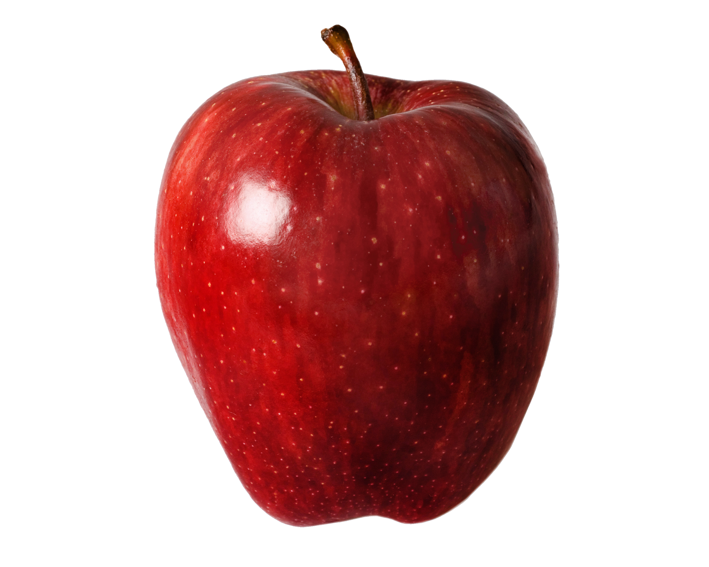

This is my README 

This is an example of a header
# header 1

## header 2

### header 3

This is an example of a list

- apple
- orange
- drinks
    - sprite
    - water 

This is how to link something

[youtube.com]

This is how to put an image in

 

Rando tests

# bold

## whats this

### test again

*emphasis*
_emphasis_

normal

**hello**

